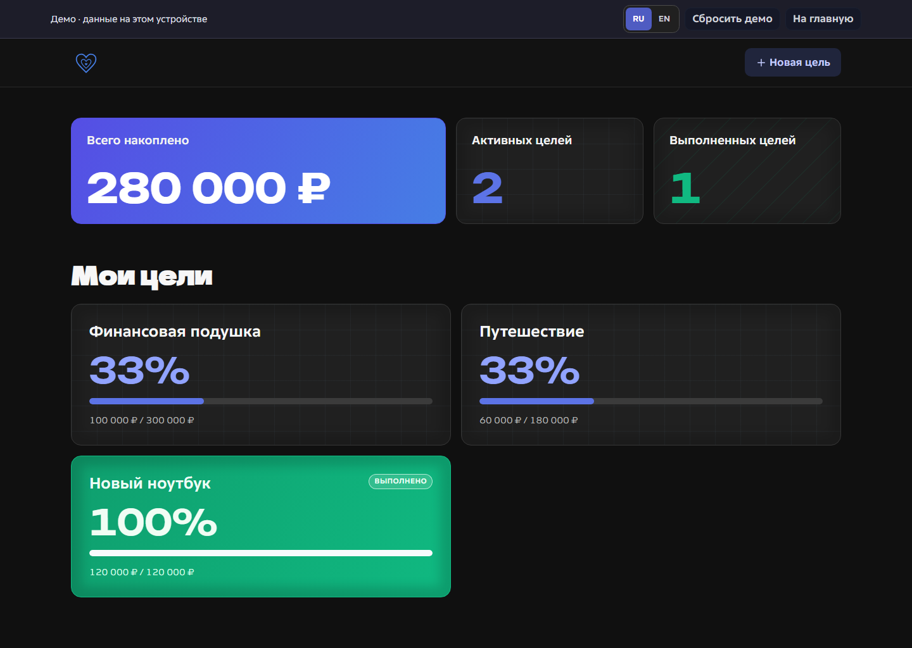
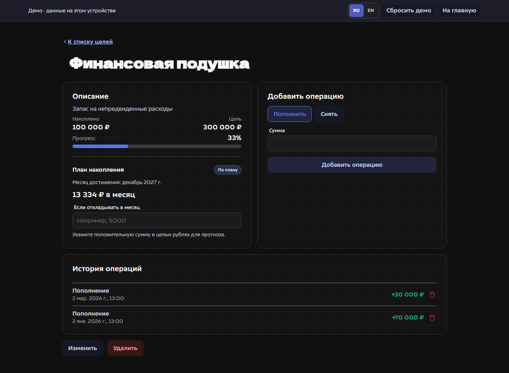

# Goal Tracker

[Русская версия](README.ru.md)

A bilingual savings goal tracker built with React and TypeScript. Visitors can try a seeded demo without an account, or use an email account to sync goals and transactions through Supabase. All amounts are whole rubles.

## Screenshots

| Welcome                                                 | Goal overview                                           | Savings plan and history                           |
| ------------------------------------------------------- | ------------------------------------------------------- | -------------------------------------------------- |
|  |  |  |

[Mobile welcome](docs/screenshots/mobile-welcome.png) · [Mobile overview](docs/screenshots/mobile-overview.png) · [Mobile goal](docs/screenshots/mobile-goal.png)

## Features

- Multiple goals with deposits, withdrawals, progress, and ordered transaction history.
- An optional target month and required contribution: `ceil(remaining / months including the current and target months)`.
- A what-if calculator forecasts the completion month for a chosen monthly contribution. Completed and overdue goals have distinct states.
- A local demo with example goals. Existing local goals stay in browser storage and are never uploaded automatically.
- Supabase Auth for email/password registration, confirmation, sign-in, and password recovery. Postgres is the source of truth for an account.
- Russian and English UI with a saved language choice.

## Architecture and tradeoffs

The app uses React 19, TypeScript, React Router, Redux Toolkit, CSS Modules, Jest, and Playwright. The same goal and transaction components render both modes. The demo store persists to `goal-tracker-demo-state`; legacy local data in `goal-tracker-state` is copied into the demo on first entry without changing the original. The cloud store never persists its ledger to browser storage. After a mutation, tab focus, or reconnect, it reloads the account's ledger from Postgres.

Cloud tables use owner-only SELECT policies. Direct client writes are revoked; five authenticated RPCs create/update/delete goals and add/delete transactions. A separate `get_ledger()` function reads both tables in one snapshot and returns the complete ledger as one object. Transactions have an explicit `position`, so order does not depend on timestamps. Each balance-changing RPC locks its goal row and validates the ordered history. Updating `ledger_version` makes a competing `REPEATABLE READ` writer fail with a serialization conflict instead of accepting a stale balance. The browser also checks common invalid actions, while the server remains authoritative.

The cloud client reloads a small complete ledger after each change instead of using realtime subscriptions or optimistic writes. This simplifies consistency and error recovery, but very large histories would need pagination. Amounts are integer RUB; fractional currency is out of scope. Local data is deliberately separate from cloud accounts. A paused Supabase Free project affects accounts, while the static demo remains usable.

## Run locally

Node.js 22.11 or newer is required.

```sh
npm ci
npm start
```

Open `http://localhost:3000`. The demo works without environment values. For cloud accounts, copy `.env.example` to `.env`, then set `SUPABASE_URL` and `SUPABASE_PUBLISHABLE_KEY` for a Supabase project with the migration applied. Webpack reads `.env` at startup. These values are public browser configuration; **never use a service-role or secret key here**.

```sh
npm run lint
npm run format:check
npm run typecheck
npm test -- --silent
npm run build
npm run test:e2e
```

Production output is `build/`. `npm run capture:screenshots` refreshes the six screenshots while `npm start` is running. The browser suite covers desktop, mobile, keyboard focus, demo operations, and the sign-in UI. pgTAP and two-session race tests run in CI; locally they require Supabase CLI, Docker, Bash, and `psql`.

## Deploy cloud accounts and the static site

1. Create a Supabase account and project. Find its **project ref** in the dashboard URL. Install the [Supabase CLI](https://supabase.com/docs/guides/local-development/cli/getting-started), then run `supabase login`, `supabase link --project-ref <ref>`, and `supabase db push` in this repository. Review the migration before applying it. Local SQL tests require Docker, `supabase db start`, and `supabase test db`; CI also runs them.
2. Push the repository to GitHub and enable **Settings → Pages → Build and deployment → Source: GitHub Actions**. The bundled workflow [`.github/workflows/deploy-pages.yml`](.github/workflows/deploy-pages.yml) builds the app and publishes `build/` on every push to `main`. Add repository variables in **Settings → Secrets and variables → Actions → Variables**: `SUPABASE_URL` and `SUPABASE_PUBLISHABLE_KEY` (find them in Supabase **Connect** or **Settings → API Keys**, `sb_publishable_…`). Never add a `secret` or `service_role` key. The site is served at `https://<owner>.github.io/<repository>/` and the workflow derives that base path automatically. If you attach a custom domain and serve the app from the root, set the `PAGES_PUBLIC_PATH` repository variable to `/`.
3. In Supabase Auth, enable email/password and email confirmation. Set **Site URL** to the Pages URL and allow the exact `https://<owner>.github.io/<repository>/auth/callback` and `https://<owner>.github.io/<repository>/auth/reset-password` redirect URLs (the wildcard `https://<owner>.github.io/<repository>/**` works too). Keep `http://localhost:3000/**` for local development. Update these values when the domain changes, or email links will point at the old address.
4. Configure custom SMTP. Purchase an email sending domain, add it in [Resend Domains](https://resend.com/docs/dashboard/domains/introduction) and wait for Verified status. Create a Resend API key, then configure Supabase SMTP: host `smtp.resend.com`, port `465`, user `resend`, password the API key, and a From address on the verified domain. Keep the API key only in Supabase settings. Without working SMTP, Supabase rejects sign-ups with HTTP 500 `Error sending confirmation email`. As a temporary alternative, disable email confirmation in **Authentication → Providers → Email**, at the cost of not verifying addresses.
5. Deploy by pushing to `main`, then test registration, email confirmation, sign-in, password reset, two-account isolation, and a direct refresh of every route on the live URL. The workflow copies `index.html` to `404.html`, so SPA routes work on GitHub Pages. Check the site from networks in Russia and abroad before sharing the link.

If sign-up still returns 500, open Supabase **Logs → Auth** for the exact cause: `Error sending confirmation email` points at SMTP, `Database error saving new user` at a database trigger (this migration defines no triggers on `auth.users`), and `email rate limit exceeded` at the mail quota.

The repository does not contain credentials or a deployed URL. Add the live GitHub Pages URL here after account and domain setup.

Provider guides: [Supabase redirect URLs](https://supabase.com/docs/guides/auth/redirect-urls), [Supabase custom SMTP](https://supabase.com/docs/guides/auth/auth-smtp), [Resend SMTP](https://resend.com/changelog/smtp-service), [GitHub Pages publishing source](https://docs.github.com/en/pages/getting-started-with-github-pages/configuring-a-publishing-source-for-your-github-pages-site), [Pages starter workflows](https://github.com/actions/starter-workflows/tree/main/pages).
