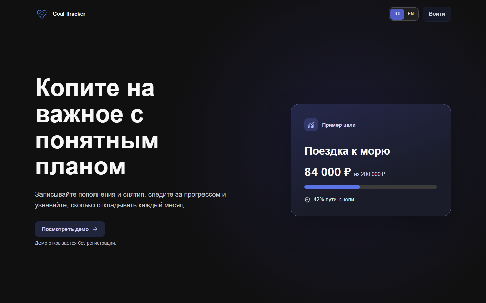
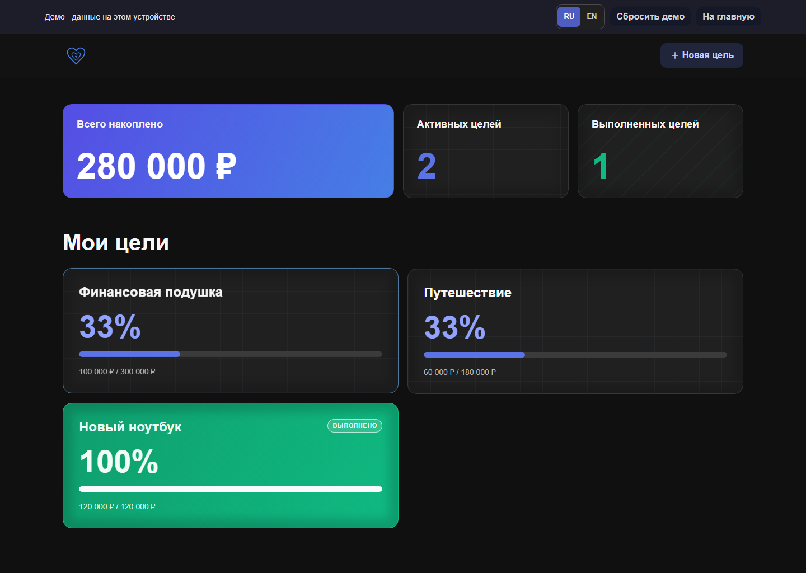
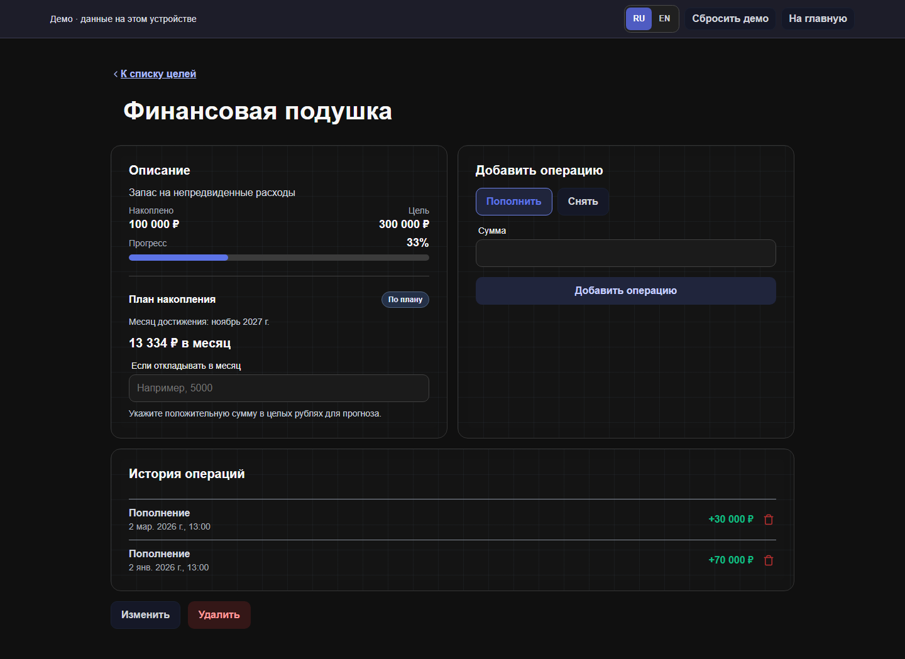

# Goal Tracker

[English version](README.md)

Двуязычный трекер накоплений на React и TypeScript. Можно открыть демо с примерами без регистрации или завести аккаунт и синхронизировать цели и операции через Supabase. Все суммы — целые рубли.

## Скриншоты

| Стартовый экран                                          | Обзор целей                                           | План и история                                    |
| -------------------------------------------------------- | ----------------------------------------------------- | ------------------------------------------------- |
|  |  |  |

[Мобильный стартовый экран](docs/screenshots/mobile-welcome.png) · [Мобильный обзор](docs/screenshots/mobile-overview.png) · [Мобильная цель](docs/screenshots/mobile-goal.png)

## Возможности

- Несколько целей, пополнения, снятия, прогресс и история операций с устойчивым порядком.
- Необязательный месяц достижения и нужный взнос: `ceil(остаток / число месяцев от текущего до целевого включительно)`.
- Калькулятор «что если» показывает прогноз месяца завершения для выбранного взноса. Выполненные и просроченные цели отмечены отдельно.
- Локальное демо с примерами. Старые локальные цели остаются в браузере и автоматически в облако не отправляются.
- Регистрация по email и паролю, подтверждение адреса, вход и восстановление доступа через Supabase Auth. Для аккаунта источником данных служит Postgres.
- Переключатель RU/EN с сохранением выбора.

## Архитектура и компромиссы

В проекте используются React 19, TypeScript, React Router, Redux Toolkit, CSS Modules, Jest и Playwright. Общие компоненты отображают локальное демо и облачный аккаунт. Демо сохраняется в `goal-tracker-demo-state`. Старые данные из `goal-tracker-state` копируются в демо при первом входе без изменения исходной записи. Облачный Redux store не записывает журнал в браузерное хранилище: после изменения, возвращения к вкладке или восстановления сети он загружает актуальные данные из Postgres.

RLS даёт пользователю SELECT только своих строк. Прямые записи из клиента запрещены: пять серверных RPC создают, изменяют и удаляют цели, добавляют и удаляют операции. Отдельная функция `get_ledger()` читает обе таблицы одним снимком и возвращает весь журнал одним объектом. Порядок операций хранится в `position`. RPC блокирует строку цели и проверяет историю баланса; изменение `ledger_version` заставляет конкурирующую запись в `REPEATABLE READ` завершиться конфликтом вместо работы с устаревшим балансом. Клиент заранее проверяет типичные ошибки, но окончательное решение принимает сервер.

Сейчас клиент после каждого изменения загружает весь небольшой журнал заново. Это упрощает согласованность и обработку ошибок, но для очень длинной истории понадобятся страницы. Дробные суммы не поддерживаются. Локальные данные не смешиваются с облачным аккаунтом и не импортируются автоматически. Если бесплатный проект Supabase приостановлен, аккаунты временно недоступны, а статическое демо продолжает работать.

## Локальный запуск

Нужен Node.js 22.11 или новее.

```sh
npm ci
npm start
```

Откройте `http://localhost:3000`. Демо работает без переменных окружения. Для облачного режима скопируйте `.env.example` в `.env`, укажите `SUPABASE_URL` и `SUPABASE_PUBLISHABLE_KEY` проекта Supabase с применённой миграцией, затем перезапустите webpack. Эти значения публичны и попадают в браузерную сборку. **Никогда не указывайте здесь service-role или secret key.**

```sh
npm run lint
npm run format:check
npm run typecheck
npm test -- --silent
npm run build
npm run test:e2e
```

Готовая сборка лежит в `build/`. `npm run capture:screenshots` обновляет шесть скриншотов при запущенном `npm start`. Браузерные тесты проверяют desktop, mobile, работу клавиатурой, операции в демо и экран входа. pgTAP и тесты гонок с двумя соединениями выполняются в CI; локально для них нужны Supabase CLI, Docker, Bash и `psql`.

## Облако и публикация

1. Создайте аккаунт и новый проект в Supabase. Возьмите **project ref** из URL панели проекта. Установите [Supabase CLI](https://supabase.com/docs/guides/local-development/cli/getting-started); в корне репозитория выполните `supabase login`, `supabase link --project-ref <ref>`, затем `supabase db push`. Перед применением к проекту проверьте миграцию. Для локального прогона SQL-тестов нужны Docker, `supabase db start` и `supabase test db`; эти тесты также запускает CI.
2. Опубликуйте текущий код в GitHub и создайте проект [Cloudflare Pages через Git](https://developers.cloudflare.com/pages/get-started/git-integration/). Укажите команду сборки `npm run build`, каталог `build`, переменную `NODE_VERSION=22.16.0`. В Supabase откройте **Connect** или **Settings → API Keys** и скопируйте URL проекта и _publishable key_ (`sb_publishable_…`). В Pages добавьте их как `SUPABASE_URL` и `SUPABASE_PUBLISHABLE_KEY` в переменные сборки, затем запустите публикацию. Запишите полученный адрес `https://<проект>.pages.dev`. Ключ `secret` или `service_role` сюда не добавляйте.
3. В Supabase Auth включите email/пароль и подтверждение адреса. Укажите адрес Pages в **Site URL**, а точные адреса `https://<проект>.pages.dev/auth/callback` и `https://<проект>.pages.dev/auth/reset-password` — в разрешённых переадресациях. Для разработки добавьте `http://localhost:3000/**`.
4. Приобретите домен для отправки писем и добавьте его в [Resend Domains](https://resend.com/docs/dashboard/domains/introduction). Скопируйте предложенные Resend DNS-записи в панель управления доменом и дождитесь статуса Verified. Создайте API key Resend. Настройте собственный SMTP в Supabase: `smtp.resend.com`, порт `465`, логин `resend`, пароль — API key Resend. Адрес отправителя должен принадлежать подтверждённому домену. Ключ хранится только в настройках Supabase; фронтенду он не нужен. Без этой настройки публичная регистрация не заработает.
5. На опубликованном адресе проверьте регистрацию, подтверждение письмом, вход, восстановление доступа, изоляцию двух аккаунтов и обновление каждой страницы по прямой ссылке. Перед публикацией ссылки проверьте сайт и оба сервиса из РФ и из-за рубежа. Демо должно открываться и при недоступном Supabase. Если позже подключите свой домен к Pages, обновите Site URL и разрешённые переадресации в Supabase.

В репозитории нет ключей и действующей публичной ссылки. Ссылку на Cloudflare Pages следует добавить сюда после настройки аккаунтов и домена.

Инструкции провайдеров: [адреса переадресации Supabase](https://supabase.com/docs/guides/auth/redirect-urls), [собственный SMTP](https://supabase.com/docs/guides/auth/auth-smtp), [SMTP Resend](https://resend.com/changelog/smtp-service), [маршруты SPA на Cloudflare Pages](https://developers.cloudflare.com/pages/configuration/serving-pages/).
